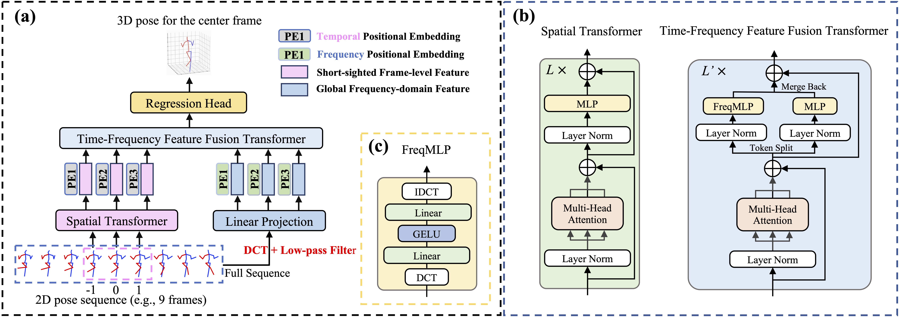
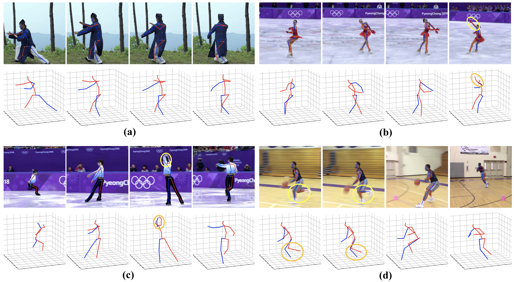
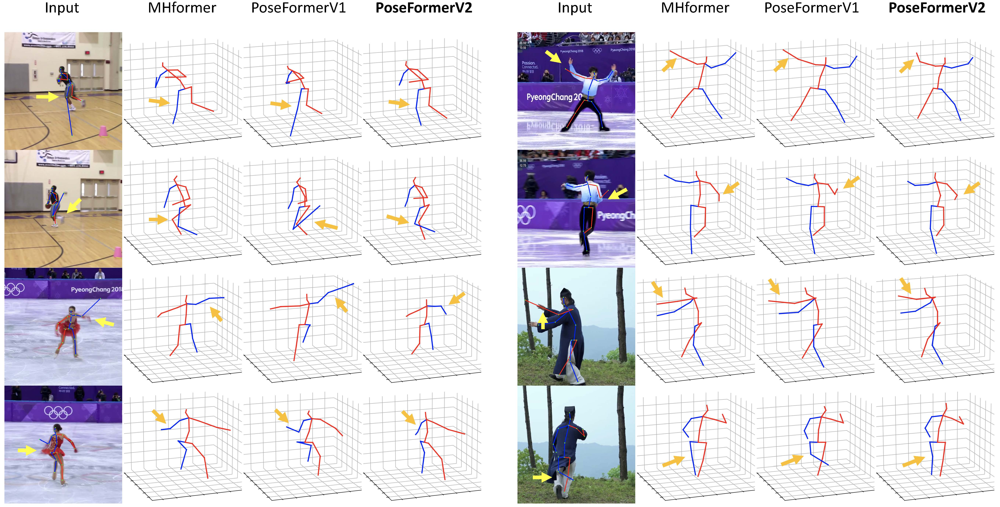

# PoseFormerV2: Exploring Frequency Domain for Efficient and Robust 3D Human Pose Estimation

This repo is the official implementation for **PoseFormerV2: Exploring Frequency Domain for Efficient and Robust 3D Human Pose Estimation**. The paper has been accepted to [CVPR 2023](https://cvpr2023.thecvf.com/).

[arXiv](https://arxiv.org/pdf/2303.17472.pdf) / [project page](https://qitaozhao.github.io/PoseFormerV2) / [video](https://www.youtube.com/watch?v=X0nAP0kdQio)

### News

[2023.03.31] Our paper on [arXiv](https://arxiv.org/pdf/2303.17472.pdf) is ready!

[2023.03.28] We build a [project page](https://qitaozhao.github.io/PoseFormerV2) where we place more descriptions and video demos.

## Introduction

PoseFormerV2 is built upon [PoseFormer](https://github.com/zczcwh/PoseFormer). It targets improving its efficiency in processing long input sequences and its robustness to noisy 2D joint detection via a frequency-domain joint sequence representation.

**Abstract.** Recently, transformer-based methods have gained significant success in sequential 2D-to-3D lifting human pose estimation. As a pioneering work, PoseFormer captures spatial relations of human joints in each video frame and human dynamics across frames with cascaded transformer layers and has achieved impressive performance. However, in real scenarios, the performance of PoseFormer and its follow-ups is limited by two factors: (a) The length of the input joint sequence; (b) The quality of 2D joint detection. Existing methods typically apply self-attention to all frames of the input sequence, causing a huge computational burden when the frame number is increased to obtain advanced estimation accuracy, and they are not robust to noise naturally brought by the limited capability of 2D joint detectors. In this paper, we propose PoseFormerV2, which exploits a compact representation of lengthy skeleton sequences in the frequency domain to efficiently scale up the receptive field and boost robustness to noisy 2D joint detection. With minimum modifications to PoseFormer, the proposed method effectively fuses features both in the time domain and frequency domain, enjoying a better speed-accuracy trade-off than its precursor. Extensive experiments on two benchmark datasets (i.e., Human3.6M and MPI-INF-3DHP) demonstrate that the proposed approach significantly outperforms the original PoseFormer and other transformer-based variants.



## Visualizations





*Credit to [MHFormer](https://github.com/Vegetebird/MHFormer). You can refer to their repo to prepare your demo.

## Cite PoseFormerV2

If you find PoseFormerV2 useful in your research, please consider citing:

```bibtex
@inproceedings{
	title={PoseFormerV2: Exploring Frequency Domain for Efficient and Robust 3D Human Pose Estimation},
	author={Zhao, Qitao and Zheng, Ce and Liu, Mengyuan and Wang, Pichao, and Chen, Chen},
	booktitle={Conference on Computer Vision and Pattern Recognition 2023},
	year={2023},
}
```

## Environment

The code is developed and tested under the following environment.

- Python 3.8
- PyTorch 1.11.0
- CUDA 11.3

## Usage

### Dataset preparation

Please refer to [VideoPose3D](https://github.com/facebookresearch/VideoPose3D) to set up the Human3.6M dataset as follows:

```
code_root/
└── data/
	├── data_2d_h36m_gt.npz
	├── data_2d_h36m_cpn_ft_h36m_dbb.npz
	└── data_3d_h36m.npz
```

### Training

You can train PoseFormerV2 on a single GPU with the following command:

```bash
python run_poseformer.py -g 0 -k cpn_ft_h36m_dbb -frame 27 -frame-kept 3 -coeff-kept 3 -c checkpoint/NAMED_PATH
```

This example shows how to train PoseFormerV2 with 3 central frames and 3 DCT coefficients from a 27-frame sequence. You can set *frame-kept* and *coeff-kept* to arbitrary values (of course <= frame number) as you like :)

### Evaluation

We provide pre-trained models with different inputs:

| Model        | Sequence Leng. |  f   |  n   | #Depth | Hidden Dim. | #MFLOPs | MPJPE (mm) |                           Download                           |
| :----------- | :------------: | :--: | :--: | :----: | :---------: | :-----: | :--------: | :----------------------------------------------------------: |
| PoseFormerV2 |       27       |  1   |  3   |   4    |     32      |  77.2   |    48.7    | [model](https://drive.google.com/file/d/14J0GYIzk_rGKSMxAPI2ydzX76QB70-g3/view?usp=share_link) |
| /            |       27       |  3   |  3   |   4    |     32      |  117.3  |    47.9    | [model](https://drive.google.com/file/d/13oJz5-aBVvvPVFvTU_PrLG_m6kdbQkYs/view?usp=share_link) |
| /            |       81       |  1   |  3   |   4    |     32      |  77.2   |    47.6    | [model](https://drive.google.com/file/d/14WgFFBsP0DtTq61XZWI9X2TzvFLCWEnd/view?usp=share_link) |
| /            |       81       |  3   |  3   |   4    |     32      |  117.3  |    47.1    | [model](https://drive.google.com/file/d/13rXCkYnVnkbT-cz4XCo0QkUnUEYiSeoi/view?usp=share_link) |
| /            |       81       |  9   |  9   |   4    |     32      |  351.7  |    46.0    | [model](https://drive.google.com/file/d/13wla4b5RgJGKX5zVehv4qKhCrQEFhfzG/view?usp=share_link) |
| /            |      243       |  27  |  27  |   4    |     32      | 1054.8  |    45.2    | [model](https://drive.google.com/file/d/14SpqPyq9yiblCzTH5CorymKCUsXapmkg/view?usp=share_link) |

You can evaluate PoseFormerV2 with prepared checkpoints as:

```bash
python run_poseformer.py -g 0 -k cpn_ft_h36m_dbb -frame 27 -frame-kept 3 -coeff-kept 3 -c checkpoint/NAMED_PATH --evaluate NAME_ckpt.bin
```

## Acknowledgment

Our codes are mainly based on [PoseFormer](https://github.com/zczcwh/PoseFormer). We follow [MHFormer](https://github.com/Vegetebird/MHFormer) to prepare our in-the-wild video demos and visualizations. Many thanks to the authors!

